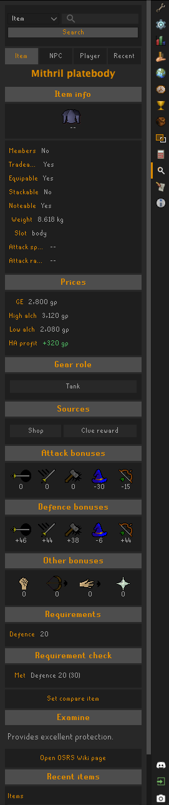
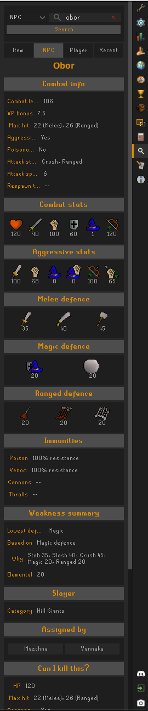
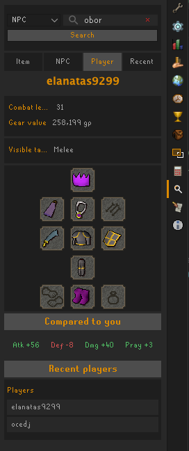
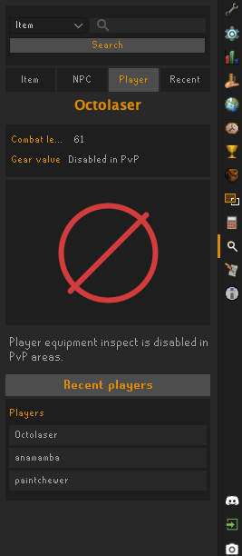
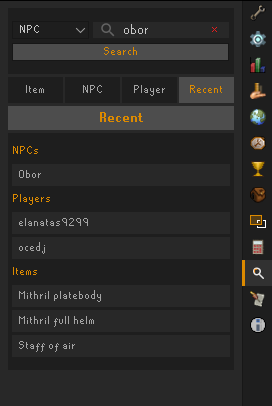

# Enhanced

Enhanced is a RuneLite plugin for optional Old School RuneScape inspect tools. It adds a single sidebar panel for looking up items, NPCs, players, and recent inspections.

Most features are backed by OSRS Wiki data. Enable OSRS Wiki lookups once in the plugin config, then the individual wiki-backed features are available by default and can be disabled separately.

## Features

- **Item inspect**: inspect item widgets or search items from the sidebar.
- **NPC inspect**: inspect NPCs or search NPCs from the sidebar.
- **Player inspect**: inspect visible player equipment from client-side player composition data.
- **Recent inspections**: return to recent item, NPC, and player inspections from the sidebar.
- **Equipment recommendations**: rank owned bank/equipped gear for inspected NPC weaknesses.
- **Bank highlights**: highlight recommended bank items with rank indicators.
- **Item prices**: show GE price, high alch, low alch, and high-alch profit or loss.
- **Requirement summaries**: show item skill requirements and missing levels where available.
- **Slayer and drop summaries**: show compact NPC Slayer and drop-table information when available from the wiki.

## Item Inspect

Item inspect shows wiki-backed item details, prices, requirements, source tags, gear-role tags, bonuses, and comparison details where available.



## NPC Inspect

NPC inspect shows combat stats, weakness summaries, Slayer details, drop summaries, a lightweight kill checklist, and equipment recommendations.



## Player Inspect

Player inspect shows equipment visible through RuneLite's player composition data. It can compare visible gear against your current equipment and show simple visible gear tags.

Player equipment inspect does not upload, store, or crowdsource player gear.



Player inspect is disabled in PVP areas.



## Recent Inspections

The Recent tab keeps short clickable lists for returning to item, NPC, and player inspections.



## Configuration

- **Enable OSRS Wiki lookups**: required for wiki-backed item, NPC, search, and recommendation features. Disabled by default because it contacts a third-party server.
- **Player equipment inspect**: adds an Inspect menu option to players.
- **NPC Inspect**: adds an Inspect menu option to NPCs. Requires OSRS Wiki lookups.
- **Item Inspect**: adds an Inspect menu option to item widgets. Requires OSRS Wiki lookups.
- **Inspect search**: enables sidebar search for item and NPC information. Requires OSRS Wiki lookups.
- **Equipment recommendations**: enables NPC gear recommendations and bank highlighting. Requires OSRS Wiki lookups.
- **Inspect cache days**: controls how long wiki data is cached.
- **Clear NPC Inspect cache**: clears cached inspect wiki data when the plugin starts.

## Data And Privacy

Enhanced uses OSRS Wiki lookups only when the wiki lookup config is enabled. Wiki responses are cached under the RuneLite directory for the configured cache duration.

Player inspect uses locally visible client data only. It does not expose player information over HTTP.

## Development

Build and test:

```sh
./gradlew test
```

Run a development RuneLite client:

```sh
./gradlew run
```
